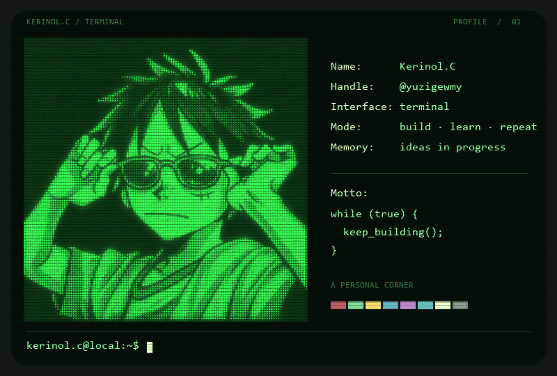

  

  <a href="https://kerinol-c.spunkyhero2.chatgpt.site/">个人网站</a> ·
  <a href="https://github.com/yuzigewmy">GitHub</a> ·
  <a href="docs/PROJECT.md">项目说明</a>

<code>while (true) { keep_building(); }</code>

